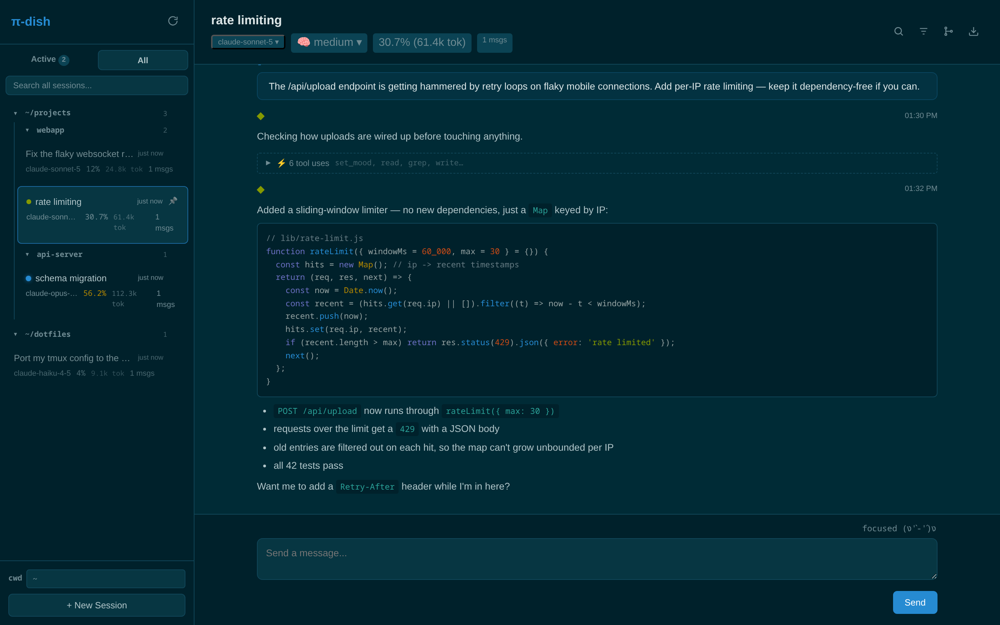
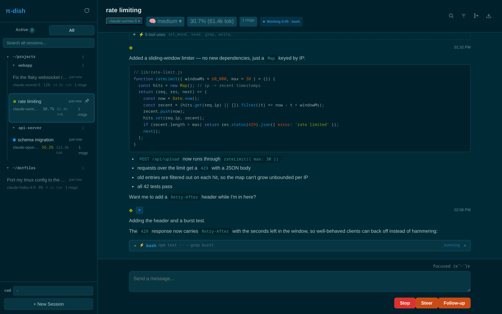
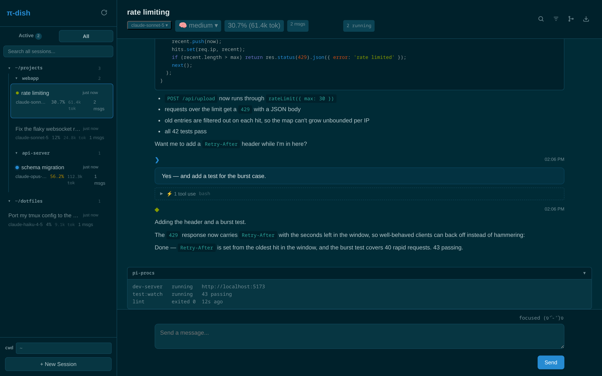
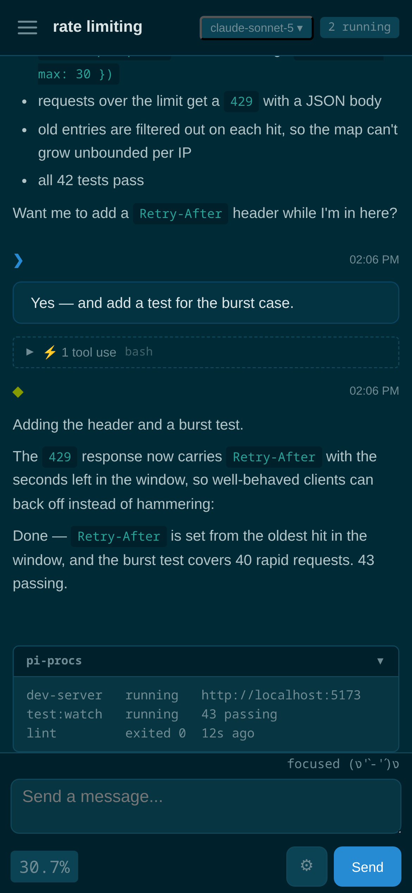

# pi-dish 📡🍽

A web (and phone) remote control for [pi](https://www.npmjs.com/package/@earendil-works/pi-coding-agent)
coding-agent sessions. Start an agent in tmux at your desk, then steer it from
the couch: watch it stream, answer its dialogs, send follow-ups, switch models,
and read back through old sessions — all from a browser on your LAN.

Full disclosure: this repo is ~100% vibecoded. A human had opinions and a
coding agent typed. It works well enough that said human uses it every day
from their phone, but read the next section before you get any ideas about
exposing it to a network you don't fully trust.

## What it looks like


*A live session: workspace-grouped sidebar, markdown + syntax highlighting, per-turn tool activity folded away, and the mood extension doing its thing above the composer.*

| Mid-turn: elapsed timer + running tool, live tool panel, steer/follow-up | Extension UI: widget cards and status badges render natively |
|---|---|
|  |  |

<p align="center"></p>

(All screenshots are staged fixture data — regenerate with `npm run shots`.)

## ⚠️ Security: there is none

Understand what this server is before running it:

- **Zero authentication.** No accounts, no passwords, no tokens. Anyone who
  can reach the port gets the full UI.
- **The UI drives coding agents.** Sending a prompt to a pi session means an
  agent with shell access executes things on your machine. Reaching this
  server is functionally equivalent to having a shell on the host.
- **It binds `127.0.0.1:3333` by default** — localhost only, nothing else
  can reach it out of the box. To use it from your phone you must opt in by
  setting `HOST` (e.g. `HOST=0.0.0.0` for all interfaces, or your Tailscale
  IP to expose it to your tailnet only) or by putting a reverse proxy in
  front. Once exposed, everything on that network gets the full UI.
- **Plain HTTP.** No TLS. Prompts, session transcripts, and everything else
  travel in cleartext.

Rules of thumb:

- Never port-forward it to the internet. Not "with a strong hostname" —
  never.
- On a home LAN you trust, fine, that's the intended use case.
- For anything beyond that, put a real front door on it: a VPN like
  Tailscale or WireGuard, or a reverse proxy that actually does auth
  (Caddy/nginx with basic auth, oauth2-proxy, Authelia, …) with pi-dish
  bound behind it. The proxy does authentication and TLS; pi-dish just
  serves whoever the proxy lets through.

## What it does

- **Session list** — live pi sessions in a sidebar (grouped by workspace,
  pinnable, collapsible), plus your full session history from pi's JSONL
  store. Status dots for working / unread activity.
- **Live streaming** — markdown renders live mid-stream via an incremental
  block renderer; tool activity folds into per-turn accordions; a working
  badge shows elapsed time and the currently running tool.
- **Prompting** — send prompts, steer mid-run, or queue follow-ups. Paste or
  attach images (downscaled client-side, phone photos are huge). Per-session
  drafts and prompt history (ArrowUp), `@file` fuzzy autocomplete.
- **Slash commands** — `/compact`, `/model`, `/name`, skills, prompt
  templates, and more, routed to the session instead of the model (support
  matrix below).
- **Extension UI** — pi extension dialogs (select/confirm/input/editor)
  render as real modals you can answer from the browser; widgets and status
  badges render natively.
- **Session controls** — model switcher (mirrors pi's scoped-models
  settings), thinking-level toggle, session rename, stats (tokens, cache,
  cost), HTML export via pi's own exporter, session tree for branching —
  with optional branch summaries (pi's `/tree` summarize flow): jump back
  to an earlier point and inject an LLM summary of the branch you're
  abandoning, so explored dead-ends still inform the conversation.
- **Reading tools** — in-session search (Ctrl+F, auto-pages older messages
  in), focus mode that hides tool noise, per-message copy buttons.
- **Mobile-first** — the whole point. Slide-out drawer, slide-up control
  panel, touch-sized everything, solarized-dark only (you're welcome).
- **Terminal** (opt-in) — a real shell at the session's cwd, in a panel
  under the transcript (xterm.js + node-pty). The shell survives phone
  screen-locks: the PTY lives server-side and reattaches with scrollback.
  Mobile gets an extra-keys bar (esc/tab/ctrl/arrows/^C). Off by default —
  start with `PI_DISH_TERMINAL=1` to enable, and reread the security
  section first: this hands a raw shell to anyone who can reach the port
  (the prompt API already executes code via the agent, but the terminal
  removes even that indirection).
- **No CDN dependencies** — `marked`, `highlight.js`, `xterm`, and a
  symbols-only Nerd Font (terminal prompt glyphs) are vendored, so it works
  on LAN clients with no internet.

There's also an Electron shell (`npm run electron:dev`) if you want it as a
desktop app for some reason.

## Requirements

- Node.js 20+
- [pi](https://www.npmjs.com/package/@earendil-works/pi-coding-agent) — the
  coding agent this whole thing remote-controls
- A network you trust (see above)

## Setup

pi-dish discovers running pi sessions through a small bridge extension that
registers each session and exposes a control socket. Symlink it once into
your global pi extensions dir:

```bash
git clone https://github.com/MrPink604/pi-dish
cd pi-dish
npm install
mkdir -p ~/.pi/agent/extensions
ln -s "$PWD/extensions/pi-dish-bridge" ~/.pi/agent/extensions/pi-dish-bridge
```

Symlink, don't copy — a stale copied bridge loaded alongside the current one
races for the session socket.

After that, any `pi` you launch (TUI in tmux, headless, spawned from
pi-dish) registers itself at `~/.pi/dish/sessions/<id>.json` and opens a
Unix socket at `~/.pi/dish/sockets/<id>.sock`. Already-running sessions pick
the extension up after a `/reload`.

Then start the server:

```bash
npm start                 # http://127.0.0.1:3333 — localhost only
PORT=8080 npm start       # different port
HOST=0.0.0.0 npm start    # expose on all interfaces (LAN)
HOST=100.x.y.z npm start  # or just your Tailscale IP
PI_DISH_TERMINAL=1 npm start  # enable the in-browser terminal (off by default;
                              # a raw shell for anyone who can reach the port —
                              # see the security section)
```

To open it from your phone at `http://<your-machine>:3333` you need one of
the `HOST` overrides above, or a reverse proxy in front of the localhost
bind (see the security section; you did read the security section?).

### Optional: the mood extension

You may notice the web UI has special-cased support for a `set_mood` tool
(a little mood indicator above the composer, e.g. `focused (ง'̀-'́)ง`).
That tool comes from a pi extension that isn't part of pi itself — which
made shipping the special-casing without the extension kinda weird, so a
copy lives at [`extensions/mood.ts`](extensions/mood.ts). It gives the
agent a `set_mood` tool and a `/mood` command, and shows the current mood
at the top-right of the TUI prompt box; pi-dish mirrors it on the web.
Entirely optional, entirely unserious. Install the same way:

```bash
ln -s "$PWD/extensions/mood.ts" ~/.pi/agent/extensions/mood.ts
```

### Upgrading

After pulling changes: `npm install`, restart the server, and `/reload` any
running pi sessions so they pick up the new bridge.

### Public share links

The stats modal (📊 in the session header) has a **Create share link** button.
A share link points at a stable token that renders a **read-only HTML export**
of that one session — pi's own exporter, the same output as `/export`. It
exposes nothing else: no API, no other sessions, no way to drive the agent.
Handy for handing a specific trace to someone without opening the whole
(unauthenticated) UI to them. **Revoke** in the same modal invalidates the
token immediately.

The share route (`GET /share/<token>`) is always served by the main server.
Three env vars tune how links are exposed:

```bash
PI_DISH_SHARE_PORT=4444 npm start   # also serve /share/<token> on a second,
                                    # share-only port (nothing else answers there)
PI_DISH_SHARE_HOST=0.0.0.0          # bind host for that share port (default: same as HOST)
PI_DISH_SHARE_BASE_URL=https://share.example.com  # absolute base for the link shown in the UI
```

`PI_DISH_SHARE_PORT` lets you put the public share port behind its own reverse
proxy while keeping the main API on localhost. `PI_DISH_SHARE_BASE_URL` just
sets the URL the UI copies out; when unset the link is built from the current
origin.

## Slash command support

| Command type | TUI session (bridge) | pi-dish-spawned session (RPC) |
|---|---|---|
| `/compact`, `/model`, `/name`, `/thinking`, `/abort` | ✅ emulated via extension API | ✅ mapped to RPC commands |
| `/new`, `/export` | ❌ (needs command context) | ✅ |
| Skills (`/skill:x`) and prompt templates | ✅ expanded by the bridge | ✅ native |
| Extension commands (`/mood`, `/todos`, …) | ❌ pi extensions can't invoke each other's commands | ✅ native |
| Other TUI built-ins (`/settings`, `/resume`, …) | ❌ TUI-only | ❌ (`/tree` has a web modal) |

Unknown commands return a clear error instead of being sent to the model.

**Dialog caveat**: when a TUI session's dialog is answered from the web, the
terminal keeps showing the already-resolved dialog until you press Escape —
pi has no API to dismiss it programmatically.

## How it works

- **Active sessions** come from the bridge extension's registry files in
  `~/.pi/dish/sessions/`. The server only connects to a session's Unix
  socket while someone is actually viewing it.
- **Historical sessions** are scanned from `~/.pi/agent/sessions/` (pi's own
  JSONL store), with mtime/size-keyed caches so the 10s sidebar poll never
  re-parses unchanged files.
- **Streaming** is SSE end to end: bridge socket → server (which coalesces
  `message_update` deltas, ~50ms window, each carries the full message so
  far) → an incremental block-level renderer that only touches changed
  blocks, so `<details>` stay open and markdown renders mid-stream.
- **Context usage** comes from the horse's mouth — the bridge writes
  `ctx.getContextUsage()` into its registry entry on every turn/model
  change, so 1M-context models report correctly instead of being guessed.
- **Spawning**: "New session" and "Resume" spawn `pi --mode rpc`; set
  `PI_DISH_PI_COMMAND` to customize the launch command (a wrapper script,
  env vars, extra flags — it also mirrors a simple `alias pi=...` from your
  shell rc).

Writing a pi extension whose UI should show up in pi-dish? See
[extensions/pi-dish-bridge/README.md](extensions/pi-dish-bridge/README.md)
for what crosses the bridge and what stays TUI-only.

## Development

```bash
npm test              # API + unit tests (node:test)
npm run test:ui       # browser smoke test (needs Chrome + global playwright)
npm run build:vendor  # regenerate public/vendor/ after bumping marked/highlight.js
npm run electron:dev  # desktop shell
```

`CLAUDE.md` documents the architecture in detail (it's the file the agent
that wrote this reads, so it's the most honest documentation in the repo).

## License

[Vibecoded / 0BSD](LICENSE) — it's mostly agent output, so it's probably
only barely copyrightable anyway. Do whatever you want with it. Vendored
third-party code (`public/vendor/`) keeps its own MIT/BSD licenses.
