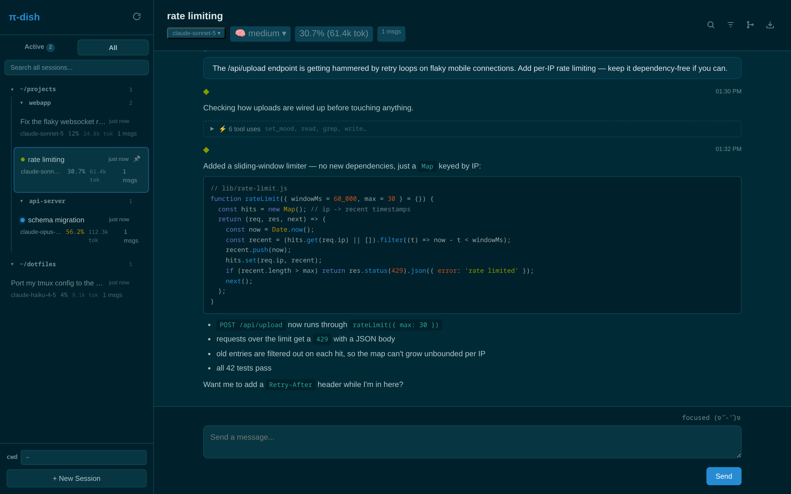
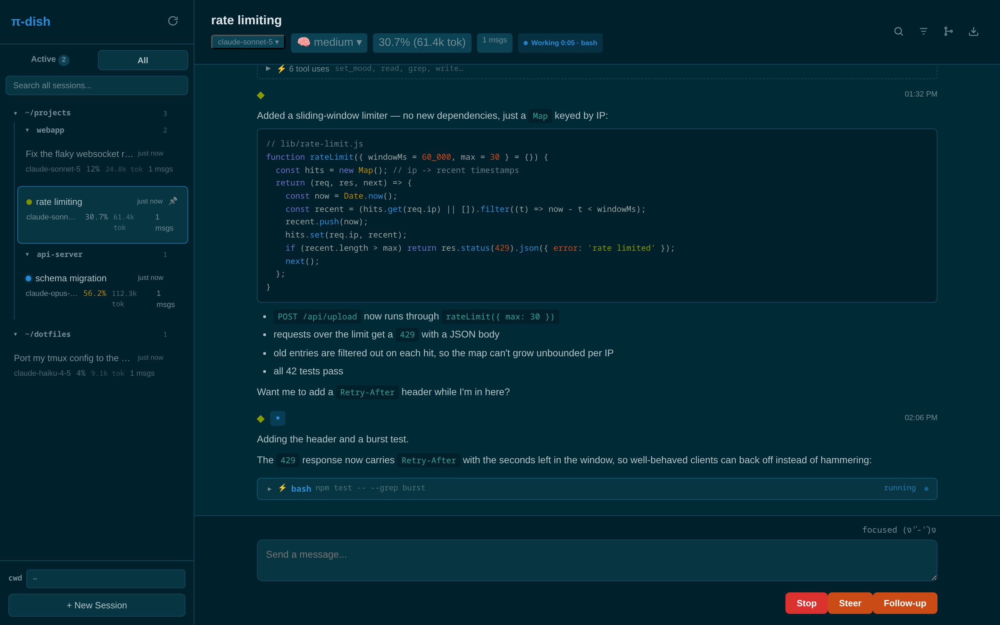
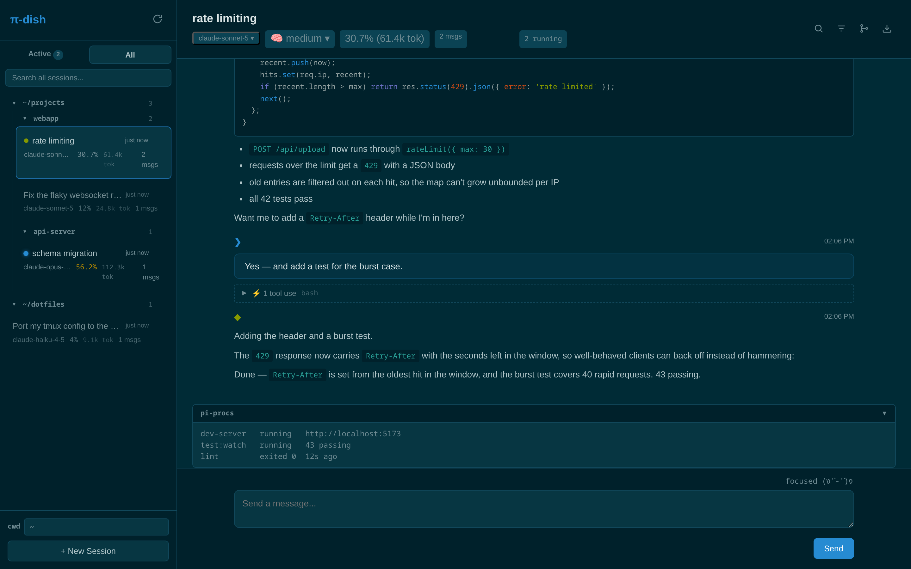
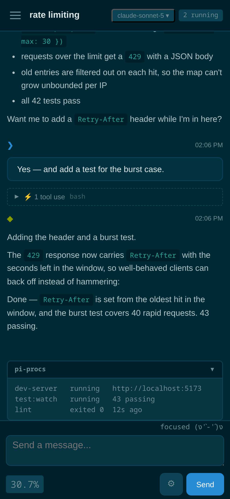

# pi-dish 📡🍽

A web (and phone) remote control for [pi](https://www.npmjs.com/package/@earendil-works/pi-coding-agent)
and selected Pi-lineage coding-agent sessions. Start an agent in tmux at your
desk, then steer it from the couch: watch it stream, answer its dialogs, send
follow-ups, switch models, and read back through old sessions — all from a
browser on your LAN.

Full disclosure: this repo is ~100% vibecoded. A human had opinions and a
coding agent typed. It works well enough that said human uses it every day
from their phone, but read the next section before you get any ideas about
exposing it to a network you don't fully trust.

## What it looks like


*A live session: workspace-grouped sidebar, markdown + syntax highlighting, per-turn tool activity folded away, and the mood extension doing its thing above the composer.*

| Mid-turn: elapsed timer + running tool, live tool panel, steer/follow-up | Extension UI: widget cards and status badges render natively |
|---|---|
|  |  |

<p align="center"></p>

(All screenshots are staged fixture data — regenerate with `npm run shots`.)

## ⚠️ Security: there is none

Understand what this server is before running it:

- **Zero authentication.** No accounts, no passwords, no tokens. Anyone who
  can reach the port gets the full UI.
- **The UI drives coding agents.** Sending a prompt to a pi session means an
  agent with shell access executes things on your machine. Reaching this
  server is functionally equivalent to having a shell on the host.
- **It binds `127.0.0.1:3333` by default** — localhost only, nothing else
  can reach it out of the box. To use it from your phone you must opt in by
  setting `HOST` (e.g. `HOST=0.0.0.0` for all interfaces, or your Tailscale
  IP to expose it to your tailnet only) or by putting a reverse proxy in
  front. Once exposed, everything on that network gets the full UI.
- **Plain HTTP.** No TLS. Prompts, session transcripts, and everything else
  travel in cleartext.

Rules of thumb:

- Never port-forward it to the internet. Not "with a strong hostname" —
  never.
- On a home LAN you trust, fine, that's the intended use case.
- For anything beyond that, put a real front door on it: a VPN like
  Tailscale or WireGuard, or a reverse proxy that actually does auth
  (Caddy/nginx with basic auth, oauth2-proxy, Authelia, …) with pi-dish
  bound behind it. The proxy does authentication and TLS; pi-dish just
  serves whoever the proxy lets through.

## What it does

- **Session list** — live pi sessions in a sidebar (grouped by workspace,
  pinnable, collapsible), plus your full session history from pi's JSONL
  store. Status dots for working / unread activity.
- **Live streaming** — markdown renders live mid-stream via an incremental
  block renderer; tool activity folds into per-turn accordions; a working
  badge shows elapsed time and the currently running tool.
- **Prompting** — send prompts, steer mid-run, or queue follow-ups. Paste or
  attach images (downscaled client-side, phone photos are huge). Per-session
  drafts and prompt history (ArrowUp), `@file` fuzzy autocomplete, and `#`
  fuzzy autocomplete over your sessions — picking one inserts its ref, and the
  agent receives it as a resolved handle it can read or message rather than an
  opaque id.
- **Slash commands** — `/compact`, `/model`, `/name`, skills, prompt
  templates, and more, routed to the session instead of the model (support
  matrix below).
- **Extension UI** — pi extension dialogs (select/confirm/input/editor) and
  OMP's native multi-question `ask` form dock into the session's
  chat box: they take over the composer while expanded, minimize to a
  backgroundable bar, and stay scoped to their session when you switch away;
  extension widgets/status badges plus OMP todos, plan mode, and prewalk state
  render natively.
- **Session controls** — model switcher (mirrors pi's scoped-models
  settings), thinking-level toggle, session rename, response performance and
  estimated-spend details, HTML export via pi's own exporter, session tree for
  branching — with optional branch summaries (pi's `/tree` summarize flow):
  jump back to an earlier point and inject an LLM summary of the branch you're
  abandoning, so explored dead-ends still inform the conversation.
- **Usage insights** — quiet per-response effective speed by default, with
  device-local metadata density controls and click-through token/cache/cost
  details. The global Settings → Usage view summarizes estimated spend by
  day, model, workspace, and session, with an optional server-wide monthly
  warning, and pivots every cost into read (uncached), cached read, output,
  and cache-write buckets — a Spend-by-bucket section, a Models/Cost-buckets
  chart stack toggle, and breakdown tooltips on the KPI tiles and rows. Known
  legacy totals without a component split remain visible as Unattributed.
  Spend is estimated from each session harness's cached model-catalog
  pricing, not provider billing; an asterisk marks the known subtotal when
  calls with unavailable pricing were omitted, and their count is shown.
- **Reading tools** — in-session search (Ctrl+F, auto-pages older messages
  in), focus mode that hides tool noise, per-message copy buttons.
- **Mobile-first** — the whole point. Slide-out drawer, slide-up control
  panel, touch-sized everything.
- **Themes** — solarized dark by default, a neutral "graphite" built in, and
  bring-your-own: drop a JSON file of token overrides in `~/.pi/dish/themes/`
  (e.g. `mytheme.json` containing `{"--bg-dark": "#101014", "--accent":
  "#7aa2f7"}` — the full token list is the `:root` block at the top of
  `public/style.css`) and it appears in the picker in the sidebar header.
- **Terminal** (opt-in) — a real shell at the session's cwd, in a panel
  under the transcript (xterm.js + node-pty). The shell survives phone
  screen-locks: the PTY lives server-side and reattaches with scrollback.
  Mobile gets an extra-keys bar (esc/tab/ctrl/arrows/^C). For sessions
  running in tmux (including headless spawns in the hidden tmux session),
  the panel's ⇆ button swaps the shell for a live view of the pi TUI's own
  tmux pane — grouped-session attach, so window switching on the phone
  never yanks your desktop client around — and the extra-keys bar grows a
  button for the server's prefix key. Off by default —
  start with `PI_DISH_TERMINAL=1` to enable, and reread the security
  section first: this hands a raw shell to anyone who can reach the port
  (the prompt API already executes code via the agent, but the terminal
  removes even that indirection).
- **No CDN dependencies** — `marked`, `highlight.js`, `xterm`, and a
  symbols-only Nerd Font (terminal prompt glyphs) are vendored, so it works
  on LAN clients with no internet.

There's also an Electron shell (`npm run electron:dev`) if you want it as a
desktop app for some reason.

## Requirements

- Node.js 22.19+
- At least one supported agent CLI: [Pi](https://www.npmjs.com/package/@earendil-works/pi-coding-agent)
  (`pi`), [Oh My Pi](https://github.com/can1357/oh-my-pi) (`omp`), or
  [Prime Agent](https://github.com/PrimeIntellect-ai/prime-agent)
  (`prime-agent`)
- A network you trust (see above)

## Setup

pi-dish discovers running sessions through bridge extensions that register
each agent and expose a control socket. The installer reconciles the runtime
dependencies, Pi bridge, OMP bridge, and every bundled skill:

```bash
git clone https://github.com/MrPink604/pi-dish
cd pi-dish
./install.sh
```

The bridge links land in `~/.pi/agent/extensions/pi-dish-bridge` and
`~/.omp/agent/extensions/pi-dish-bridge-omp`. Every directory under
`skills/` is linked into both agents' default `skills/` directories.
`PI_AGENT_DIR` and `OMP_AGENT_DIR` override those destinations for an isolated
install, and `./install.sh --links-only` skips `npm ci`.

`pi-dish-pages` teaches agents to publish HTML artifacts,
`pi-dish-comments` gives them a small CLI-backed inbox for anchored feedback,
and `pi-dish-sessions` lets an agent spawn and interact with ordinary peer Pi
sessions through the existing server controls. Ask an agent to "publish the
plan as a page" and you get back a link; see "Published pages" below.
`pi-dish-skill-refine` is the default methodology the Skills view's
"✎ Refine with an agent" button drafts against.

The installer always symlinks rather than copying, so pulling the checkout
updates every installed bridge and skill in place. It refuses to replace a
real file or directory at any managed destination; remove or relocate that
conflict explicitly, then rerun it. A stale copied bridge loaded alongside
the current one can race for the session socket.

### Oh My Pi and Prime Agent

The new-session picker can also launch OMP and Prime in tmux. Their permanent
thin wrappers are:

- `extensions/pi-dish-bridge-omp/index.ts`
- `extensions/pi-dish-bridge-prime/index.ts`

OMP launched outside pi-dish loads the installed default wrapper
automatically. Prime still needs its wrapper passed with `--extension`.
Managed launches pass a generated module under
`~/.pi/dish/launch-wrappers/` instead; it imports the same thin wrapper and
embeds the one-launch correlation token. This matters for Prime because its
resident daemon forwards extension paths to workers but does not forward
arbitrary client environment variables. Generated modules are retained so a
resident worker can reload or recover its extension later.

OMP and Prime use the shared public-extension bridge and never start or fall
back to native RPC. Their history is discovered from `~/.omp/agent/sessions/`
and `~/.prime/agent/sessions/` respectively.

OMP's `ask` tool uses the same UI context OMP gives extensions, so the wrapper
races its browser form against the local TUI form and the first answer wins.
OMP's exported `AgentSession` getters drive bridge-owned `Todos`, `planmode`,
and `prewalk` projections; they are capability-detected, so an older OMP keeps
ordinary bridge behavior instead of failing extension load.

The alternative-harness baseline deliberately omits private Pi features:
queue cancellation, compaction, tree navigation, and inactive JSONL mutation
are unavailable. OMP supports read-only HTML export and sharing; Prime does
not. An OMP session launched by pi-dish can be closed remotely: pi-dish
revalidates its launch token and exact tmux pane process identity, proves the
live OMP process belongs to that pane, then kills the pane and waits for its
captured process tree to exit. OMP sessions launched outside pi-dish remain
uncloseable. Prime's agent worker is resident, so “Detach client” instead proves
the worker is outside the owned pane's process tree before killing only the
pane. If ancestry cannot be proven, either operation fails closed. Prime detach
never signals or claims to stop the logical agent. In the pinned Prime 0.7.1
canary the worker remains a client descendant, so pi-dish disables/refuses
detach rather than risking the worker.

Use `PI_DISH_OMP_COMMAND` or `PI_DISH_PRIME_COMMAND` when a CLI is not on
`PATH`, analogous to `PI_DISH_PI_COMMAND` for Pi.

To make OMP's built-in `/share` publish its native live export through
pi-dish instead of OMP's default share service, install the optional custom
share hook:

```bash
mkdir -p ~/.omp/agent
ln -s "$PWD/extensions/pi-dish-share-omp.mjs" ~/.omp/agent/share.mjs
```

OMP sessions launched by pi-dish inherit `PI_DISH_URL` automatically. For an
OMP process launched elsewhere, set it to the reachable pi-dish server, for
example `PI_DISH_URL=http://127.0.0.1:3333 omp`. OMP builds the HTML before it
calls this hook, so the resulting pi-dish link preserves OMP's native viewer,
effective system prompt, active tool list, and OMP-specific transcript entry
types. Set `PI_DISH_SHARE_BASE_URL` on the pi-dish server when the returned
link should use a different public origin.

The share button in pi-dish also uses OMP's native renderer. While the OMP
session is live, the bridge supplies the current system prompt and active tool
descriptions to that export. An offline historical JSONL still renders all of
its persisted OMP records natively, but cannot reconstruct runtime-only prompt
or tool state that OMP did not write to the file.

The current real-host compatibility canary is pinned to OMP 17.2.11 (which
requires Bun 1.3.14+) and Prime Agent 0.7.1. See Development for the isolated
install and test command.

After that, any `pi` you launch (TUI in tmux, headless, spawned from
pi-dish) writes an instance-scoped entry under `~/.pi/dish/sessions/` and opens
a hashed Unix socket under `~/.pi/dish/sockets/`. Already-running sessions pick
the extension up after a `/reload`.

Unix socket paths have a small platform limit. The bridge checks the full
UTF-8 path against a conservative 103-byte ceiling before it starts. If your
home path makes the default too long, set a short **absolute** directory for
every `pi` process (and for pi-dish) rather than relying on an automatic temp
fallback:

```bash
export PI_DISH_SOCKET_DIR=/run/user/$(id -u)/pi-dish
npm start
```

The bridge creates a missing directory with mode `0700` and automatically
tightens its owned default `~/.pi/dish/sockets/` directory from older releases
to `0700`. An override whose resulting full socket path is too long is still
rejected. An existing override directory must already be owned by the current
user with mode `0700`; pi-dish reports an actionable error instead of changing
arbitrary override permissions. pi-dish forwards the setting to sessions it
launches in tmux; independently launched `pi` processes must inherit it from
your shell or service environment.

Then start the server:

```bash
npm start                 # http://127.0.0.1:3333 — localhost only
PORT=8080 npm start       # different port
HOST=0.0.0.0 npm start    # expose on all interfaces (LAN)
HOST=100.x.y.z npm start  # or just your Tailscale IP
PI_DISH_TERMINAL=1 npm start  # enable the in-browser terminal (off by default;
                              # a raw shell for anyone who can reach the port —
                              # see the security section)
```

To open it from your phone at `http://<your-machine>:3333` you need one of
the `HOST` overrides above, or a reverse proxy in front of the localhost
bind (see the security section; you did read the security section?).

### Optional: the mood extension

You may notice the web UI has special-cased support for a `set_mood` tool
(a little mood indicator above the composer, e.g. `focused (ง'̀-'́)ง`).
That tool comes from a pi extension that isn't part of pi itself — which
made shipping the special-casing without the extension kinda weird, so a
copy lives at [`extensions/mood.ts`](extensions/mood.ts). It gives the
agent a `set_mood` tool and a `/mood` command, and shows the current mood
at the top-right of the TUI prompt box; pi-dish mirrors it on the web.
Entirely optional, entirely unserious. Install the same way:

```bash
ln -s "$PWD/extensions/mood.ts" ~/.pi/agent/extensions/mood.ts
```

### Upgrading

After pulling changes, run `./install.sh`, restart the server, and `/reload`
running Pi or OMP sessions so they load the updated bridge. A tmux-managed
server can be reconciled with `scripts/pi-dish-tmux.sh restart`; it uses the
`pi-dish` session and `server` window by default.
The manager always targets the default tmux server, even when invoked from
inside a pane attached to another socket.

### Peer session control

The optional `pi-dish-sessions` skill wraps the server's normal session APIs;
it is an ergonomic control client, not a subagent framework. A spawned peer is
an ordinary Pi process using the existing hidden-tmux/RPC dispatch. The CLI can
list, spawn, inspect, prompt, steer, queue a follow-up, interrupt, resume, and
gracefully close sessions:

```bash
CLI=~/.pi/agent/skills/pi-dish-sessions/scripts/pi-dish-sessions.js
node "$CLI" spawn --cwd "$PWD" --name investigation --prompt "Check the cache race" --json
node "$CLI" list --active
node "$CLI" related <session-id>
node "$CLI" follow-up <session-id> "Then summarize the result"
```

Pi's native `parentSession` header is read when present. Launches requested
through this CLI also get advisory provenance in
`~/.pi/dish/session-provenance.json`; pi-dish never appends custom control
metadata to Pi JSONL. Related-session chips appear beneath the selected session
header. In the unfiltered sidebar, same-workspace children also nest beneath
their parent as a parent-first block sorted by the newest activity in the whole
family. Families start collapsed; pinning or dragging any member moves the whole
family block. Sessions launched by other schemes remain normal rows and degrade
by what is available: live bridge controls when registered, historical read/resume
when only JSONL remains, and no relation decoration when no hint exists.

### Public share links

The stats modal (📊 in the session header) has a **Create share link** button.
A share link points at a stable token that renders a **read-only HTML export**
of that one session — pi's own exporter, the same output as `/export`. It
exposes nothing else: no API, no other sessions, no way to drive the agent.
Handy for handing a specific trace to someone without opening the whole
(unauthenticated) UI to them. **Revoke** in the same modal invalidates the
token immediately.

The share route (`GET /share/<token>`) is always served by the main server.
Three env vars tune how links are exposed:

```bash
PI_DISH_SHARE_PORT=4444 npm start   # also serve /share/<token> on a second,
                                    # share-only port (nothing else answers there)
PI_DISH_SHARE_HOST=0.0.0.0          # bind host for that share port (default: same as HOST)
PI_DISH_SHARE_BASE_URL=https://share.example.com  # absolute base for the link shown in the UI
```

`PI_DISH_SHARE_PORT` lets you put the public share port behind its own reverse
proxy while keeping the main API on localhost. `PI_DISH_SHARE_BASE_URL` just
sets the URL the UI copies out; when unset the link is built from the current
origin.

### Published pages

Agents often generate HTML explainer artifacts — a plan, a report, a little
dashboard. pi-dish can host them: the agent writes the file(s) to disk and
registers the path, and the server serves it at `/page/<token>` — live from
disk, so the agent editing the file and saying "refresh" is the whole update
loop.

```bash
curl -s -X POST "${PI_DISH_URL:-http://localhost:3333}/api/pages" \
  -H 'Content-Type: application/json' \
  -d '{"path":"/abs/path/plan.html","title":"Refactor plan"}'
# → { "token": "…", "path": "/page/…", "url": null }
```

The `pi-dish-pages` skill (see Setup) teaches agents this flow; sessions
spawned from pi-dish get `PI_DISH_URL` in their env automatically. A root can
be a single file or a directory with an `index.html` (relative assets are
served under the token). Publishing is deliberately ungated — anyone who can
reach the main UI is trusted; the share-only port never registers pages, it
only serves existing tokens (`/page/<token>` is available there alongside
`/share/<token>`). You can also publish by hand: the file viewer (tap any
file mention in a transcript) has a 🌐 button, and the stats modal lists a
session's pages with revoke.

In a multi-host fleet, one host can front the others' pages and share links:
publishing or sharing through its `/hosts/<name>` proxy (which is what the UI
does when you're viewing a peer's session) records the token and hands back
that host's own link, and `/share` + `/page` there stream the content from
whichever host owns it. Agents do the same with the pages skill's `--via
<hub>` (or a `PI_DISH_PUBLIC_VIA` default), always through their own server.
Revoking on the owning host kills the link everywhere; `DELETE
/api/fleet-artifacts/<token>` on the front-door host only stops it fronting.

### Anchored comments

Select text in the file viewer, select lines in the uncommitted-diff view, or
select prose in a published HTML page, then use the 💬 action to leave a
comment for that session's agent. Comments live outside the transcript. The
act of adding one never prompts, steers, queues, or starts the agent. Tell the
agent “there are comments; go read them” when you want it to act. The skill
first inventories every open comment by location and short intent, then
fetches whatever groups it infers belong together. Acknowledgment closes a
handled comment but is never required to inspect another one.

The bundled CLI is also usable directly:

```bash
node ~/.pi/agent/skills/pi-dish-comments/scripts/pi-dish-comments.js list
node ~/.pi/agent/skills/pi-dish-comments/scripts/pi-dish-comments.js get <id> [<id> ...]
node ~/.pi/agent/skills/pi-dish-comments/scripts/pi-dish-comments.js ack <comment-id>
```

It identifies the calling agent through the bridge registry and process
ancestry; `--session <id>` is available for ambiguous cases. A comment has
only two states: open and acknowledged. Acknowledging it closes it—there are
no replies, threads, assignments, or resolution workflow.

## Slash command support

| Command type | TUI session (bridge) | pi-dish-spawned session (RPC) |
|---|---|---|
| `/compact`, `/model`, `/name`, `/thinking`, `/abort` | ✅ emulated via extension API | ✅ mapped to RPC commands |
| `/new`, `/export` | ❌ (needs command context) | ✅ |
| Skills (`/skill:x`) and prompt templates | ✅ expanded by the bridge | ✅ native |
| Extension commands (`/mood`, `/todos`, …) | ❌ pi extensions can't invoke each other's commands | ✅ native |
| Other TUI built-ins (`/settings`, `/resume`, …) | ❌ TUI-only | ❌ (`/tree` has a web modal) |

Unknown commands return a clear error instead of being sent to the model.

**Dialog caveat**: when a TUI session's dialog is answered from the web, the
terminal keeps showing the already-resolved dialog until you press Escape —
pi has no API to dismiss it programmatically.

## How it works

- **Active sessions** come from the bridge extension's registry files in
  `~/.pi/dish/sessions/`. The server only connects to a session's Unix
  socket while someone is actually viewing it.
- **Historical sessions** are scanned from `~/.pi/agent/sessions/` (pi's own
  JSONL store), with mtime/size-keyed caches so the 10s sidebar poll never
  re-parses unchanged files.
- **Streaming** is SSE end to end: bridge socket → server (which coalesces
  `message_update` deltas, ~50ms window, each carries the full message so
  far) → an incremental block-level renderer that only touches changed
  blocks, so `<details>` stay open and markdown renders mid-stream.
- **Context usage** comes from the horse's mouth — the bridge writes
  `ctx.getContextUsage()` into its registry entry on every turn/model
  change, so 1M-context models report correctly instead of being guessed.
- **Spawning**: "New session" and "Resume" open pi in a hidden, detached tmux
  session (`tmux -L pi-dish attach -t headless` to peek at one) when tmux and
  the bridge extension are available, so headless sessions **survive server
  restarts**; without them, pi runs as an RPC child of the server (which dies
  when the server restarts). `PI_DISH_HEADLESS=rpc|tmux` overrides the
  auto-detection. Set `PI_DISH_PI_COMMAND` to customize the launch command (a
  wrapper script, env vars, extra flags — it also mirrors a simple
  `alias pi=...` from your shell rc). The **Run in** selector (shown when tmux
  is installed) instead opens a real pi TUI as a new window on a chosen tmux
  server, detaching/reattaching like any tmux window. pi-dish drives spawned
  sessions over the bridge once its extension registers (windows are
  correlated to their registration by a one-shot `PI_DISH_SPAWN_TOKEN`).

Writing a pi extension whose UI should show up in pi-dish? See
[extensions/pi-dish-bridge/README.md](extensions/pi-dish-bridge/README.md)
for what crosses the bridge and what stays TUI-only.

## Development

```bash
npm test              # API + unit tests (node:test)
npm run test:ui       # browser smoke test (needs Chrome + global Playwright)
npm run build:vendor  # regenerate public/vendor/ after bumping marked/highlight.js
npm run electron:dev  # desktop shell
```

The opt-in lineage canary runs the actual released OMP and Prime CLIs through
pi-dish's tmux/HTTP orchestration. It uses an isolated HOME, tmux server,
socket directory, and Prime daemon. A local fake OpenAI Responses endpoint
provides a deterministic streamed model turn, so no provider credentials or
paid request are needed. One reproducible isolated install is:

```bash
PREFIX="$HOME/.local/share/pi-dish-harnesses"
npm install --prefix "$PREFIX/bun" --no-audit --no-fund bun@1.3.14
BUN="$PREFIX/bun/node_modules/.bin/bun"
BUN_INSTALL="$PREFIX/omp" "$BUN" install -g @oh-my-pi/pi-coding-agent@17.2.11
curl -fsSL https://app.primeintellect.ai/prime-agent/install.sh | \
  env PRIME_AGENT_BOOTSTRAP_KERNEL_ON_INSTALL=0 \
      PRIME_AGENT_INSTALLER_PLAIN=1 \
      npm_config_prefix="$PREFIX/prime" \
      PATH="$PREFIX/bun/node_modules/.bin:$PATH" \
      sh -s -- 0.7.1

PI_DISH_REAL_OMP_BIN="$PREFIX/omp/bin/omp" \
PI_DISH_REAL_PRIME_BIN="$PREFIX/prime/bin/prime-agent" \
PI_DISH_REAL_BUN_BIN_DIR="$PREFIX/bun/node_modules/.bin" \
npm run test:lineage
```

The canary covers real wrapper registration, model/command discovery, a live
streamed turn and persisted transcript, canonical history routes, OMP resume
and unsupported close behavior, plus Prime's worker/client split, unsafe-detach
refusal, exact-daemon cleanup, resume, and a second streamed/persisted turn
after resume.

`CLAUDE.md` documents the architecture in detail (it's the file the agent
that wrote this reads, so it's the most honest documentation in the repo).

## License

[Vibecoded / 0BSD](LICENSE) — it's mostly agent output, so it's probably
only barely copyrightable anyway. Do whatever you want with it. Vendored
third-party code (`public/vendor/`) keeps its own MIT/BSD licenses.
