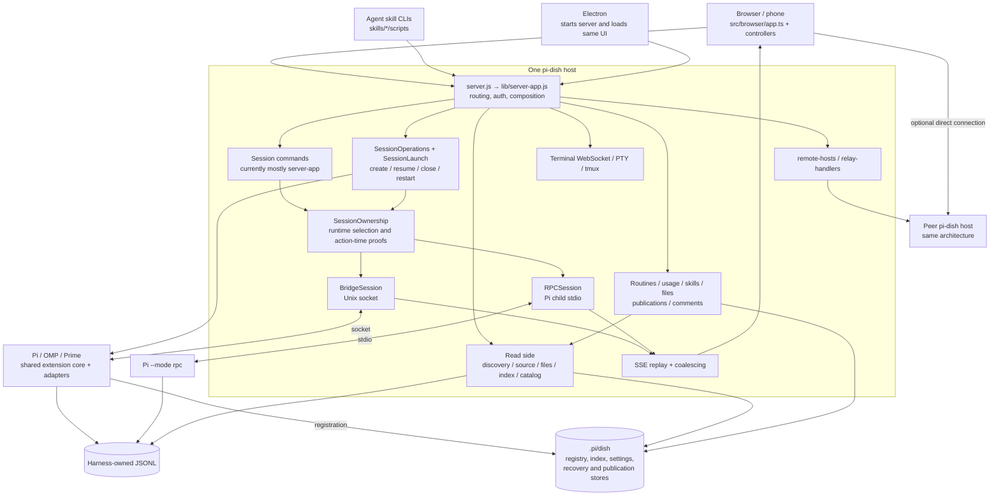

# Architecture simplification proposal

Date: 2026-09-28. Source baseline: `b985b5db18a236835b5f5a47565d21e8d40d1224`.

Status: **Proposal, not implementation approval or delivery evidence.** The
[review receipt](architecture-simplification-review-2026-09-28.md) records the
requested Opus 5.5/high review, disagreements, resolutions and final disposition.

The source baseline is descriptive, not a frozen implementation checkout. During
review, HEAD advanced to `aa12aeb` and concurrent model-picker work changed browser
sources/exports. Before each stage, re-baseline references and behavior against the
then-current HEAD and worktree; preserve that work and drop duplication already
removed elsewhere. In particular, repeat S1's export audit and S7's catalog/model
selector audit rather than implementing directly from these historical line links.

## 1. Decision and intended outcome

Keep the current Express/CommonJS runtime, vanilla TypeScript browser, harness
bridge architecture and checked-in generated outputs. Simplify repeated decisions
at existing boundaries rather than extracting more factories or introducing a
framework, generic repository, universal transport superclass or global UI store.

The proposed program has three kinds of change:

1. **Pure algorithm consolidation:** comment anchors, usage arithmetic, bounded tree
   topology reuse, and the two remaining message-formatting expressions.
2. **Semantic interface consolidation:** pi-dish-owned emulated command facts and
   consistent transport method signatures, then only worthwhile HTTP handler reuse.
3. **Ownership clarification:** reuse the existing catalog API without splitting
   the current shared catalog instance; share asynchronous request mechanics only
   where invalidation and credential rules actually match.

Each stage must delete competing implementations across its complete consumer
set. Moving a function behind another forwarding layer is not an accepted result.
No stage is justified solely by fewer lines, fewer files or more TypeScript.

Expected maintenance outcome: quote matching, usage arithmetic, pi-dish emulation
metadata, and model-catalog URL selection/decoding each have one implementation
owner. Specialized harness request/cache/failure policies remain explicit.
Performance improvement is not presumed; existing hot-path costs must not increase.

## 2. Current architecture

### 2.1 Physical source and runtime boundaries

| Authored source | Runtime output / execution | Responsibility |
| --- | --- | --- |
| `server.js` | Node launcher; one line | Starts the application and exports the initial native HTTP server. |
| `src/core/server-app.ts` | `lib/server-app.js` | Express composition, remaining session command/query policy, SSE, listener lifecycle. |
| `src/core/session-{discovery,source,files,index,metadata,catalog}.ts` | Corresponding `lib/` modules | Historical identity discovery, explicit sources, JSONL parsing, persistent derived index, metadata and catalog composition. |
| `src/core/session-{ownership,launch,operations,recovery,bounces}.ts`, `recovery-runner.ts` | Corresponding `lib/` modules | Runtime proofs, launch, destructive operation coordination, durable recovery and bulk maintenance. |
| `src/core/{bridge-session,rpc-session,harnesses,pi-sdk}.ts` | Corresponding `lib/` modules | Socket/RPC transport and harness/SDK adaptation. |
| `src/core/*handlers.ts` and feature modules | Corresponding `lib/` modules | Publications, files, usage, settings, skills, routines, relay, auth and terminal. |
| `src/core/helper-*.ts` | Core output and bundled portable browser/CLI imports | Shared pure runtime logic; existing compatibility exports remain stable. |
| `src/browser/` | Five generated scripts under `public/` | Browser composition, state, controllers and rendering. |
| `extensions/pi-dish-bridge/core.ts` plus Pi/OMP/Prime adapters | Loaded by the host harness | Registry/socket lifecycle, host command/event adaptation, replay state. |
| `skills/` and `electron/main.ts` | Sibling generated outputs via `build:edges` | HTTP clients and a shell loading the same server/UI. |
| `scripts/`, compiler configs, `test/` | Checked build/test runtime boundaries | Source policy, generation, packaging and isolated verification. |

At the inspected baseline, `src/core/` contains 86 source modules and
`src/browser/` 109. `server-app.ts` is 2,641 lines and `app.ts` 1,311 lines.
These are navigation indicators, not complexity or duplication metrics.

The main page loads `theme-prepaint.js`, local `marked`, and `app.js`.
`browser.js` and `helpers.js` are additional generated entrypoints, not parallel
application implementations loaded beside `app.js`. See
[build entries](../scripts/build-browser.ts#L12) and
[production script tags](../public/index.html#L13).

### 2.2 Runtime map

The browser aggregates the fleet. A relay supplies reachability, not a hub-owned
merged session database. Electron does not introduce a second backend.

### 2.3 Primary hot paths

**Session list:** `sidebar-lists` → per-host `host-session-loader` →
`GET /api/sessions` → live registry/RPC observations + historical discovery →
`session-index.scanSessions` → `composeSessionCatalog` → decoded host-stamped
`sessionState.setSessionLists` → sidebar/header. The active-only path deliberately
avoids the full historical scan.

**Selection/history:** `session-view.select` validates its target, invalidates the
old selection generation, stashes draft/DOM, retires session resources and establishes
the new selection. `transcript` restores retained DOM or fetches `/messages`;
`session-source` resolves the captured identity, `session-files` reads the history,
and render/finalization follows. SSE starts only while the captured owner remains
current. See [selection retirement](../src/browser/session-view.ts#L50) and
[history reads](../src/core/session-read-handlers.ts#L140).

**Prompt/live display:** composer captures selection + endpoint → optimistic echo
and delivery ledger → prompt/steer/follow-up endpoint → live-session capability
admission → bridge/RPC command → agent events → SSE replay/coalescing (50 ms) →
browser event routing → incremental block rendering (80 ms). Completion triggers
JSONL catch-up, replacing unindexed live placeholders with authoritative indexed
messages. See [delivery routes](../src/core/server-app.ts#L1059),
[SSE](../src/core/server-app.ts#L2252) and
[streaming rendering](../src/browser/streaming-render.ts#L6).

SSE is a projection, not durable history. The two throttles serve different costs:
network traffic and DOM work. Neither is redundant.

### 2.4 Existing owners to retain

| State or decision | Existing owner | Must not become |
| --- | --- | --- |
| Persisted conversation | Harness JSONL | A browser/SSE-owned transcript store. |
| Resolved read source | `session-source` | Proof of process ownership. |
| Live/history catalog row | `session-catalog` | Authorization to close/restart. |
| Runtime claim/process/pane proof | `session-ownership` | An unchecked capability flag or cached catalog observation. |
| Destructive operation flights | `session-operations` | Separate implementations inside routines, recovery or bounce. |
| Browser lists/selected metadata | `session-state` writers | Direct mutable aliases held by feature controllers. |
| Selection transition | `session-view` | Unordered lifecycle callbacks in a generic controller registry. |
| Pages/cursors/retained DOM | `transcript` and `transcript-cache` | A global cache merged with selection or optimistic delivery. |
| Optimistic/queued delivery | `prompt-delivery` | Authority over persisted message indexes. |
| Effective hosts/routing | `host-directory` | Per-feature endpoint lookup policy. |
| Runtime host health | `host-connections` | Persisted host configuration. |

## 3. Duplication inventory and disposition

This is a production-source behavioral inventory, not a token-based clone report.
Generated output, vendor code and fixtures are excluded. Similar output shapes
alone are not enough to justify combining owners.

| Cluster | Evidence | Disposition |
| --- | --- | --- |
| Quote matching, DOM marks and comment placement | [page comments](../src/browser/artifact-comments.ts#L283), [app anchors](../src/browser/comment-anchors.ts#L27), [app bubble](../src/browser/anchored-comments.ts#L52) | S1: shared algorithms; separate editors/routing. |
| Usage bucket math and ranking | [server](../src/core/usage-feature-handler.ts#L19), [browser](../src/browser/helper-usage.ts#L32) | S2: portable arithmetic; separate aggregation policy. |
| Live/file tree flattening | [bridge](../extensions/pi-dish-bridge/core.ts#L444), [SDK](../src/core/pi-sdk.ts#L343) | S3: share topology only where worthwhile; preserve distinct display projections. |
| Final/live message formatting | [final](../src/browser/message-render.ts#L144), [incremental](../src/browser/streaming-render.ts#L50) | S4: common decisions; separate DOM algorithms. |
| Builtin command metadata/capability maps | [bridge](../extensions/pi-dish-bridge/core.ts#L246), [SDK](../src/core/pi-sdk.ts#L289), [RPC catalog](../src/core/model-feature-handlers.ts#L13) | S5: share pi-dish emulation facts; keep the upstream TUI mirror separate. |
| Delivery/control dispatch and transport-specific signatures | [HTTP commands](../src/core/server-app.ts#L1059), [model mutation](../src/core/server-app.ts#L1592), [LiveSession union](../src/core/session-ownership.ts#L19) | S6: normalize the existing method first; gate further handler extraction. |
| Routine versus shared model/harness reads | [routine loaders](../src/browser/routines-view.ts#L453), [current-row catalog](../src/browser/model-catalog.ts#L24), [new-session composition](../src/browser/new-session.ts#L92) | S7: reuse existing model API; preserve shared catalog identity and differing harness decoders. |
| Captured targets, request generations and retirement | [transcript](../src/browser/transcript.ts#L18), [routine form](../src/browser/routines-view.ts#L47), [comments](../src/browser/anchored-comments.ts#L16) | S8: only exact common mechanics; distinct invalidation scopes. |
| Host fanout/progressive results | [search](../src/browser/search-view.ts#L11), [usage](../src/browser/usage-view.ts#L16), [existing render queue](../src/browser/helper-usage.ts#L15) | S8 bounded candidate, not a universal fleet data service. |
| Bridge/RPC live-state bookkeeping | [bridge events](../src/core/bridge-session.ts#L523), [RPC events](../src/core/rpc-session.ts#L223) | Defer broad reducer work; existing pending/tool/UI helpers already remove much duplication. |
| HTTP JSON/error extraction | [API helper](../src/browser/api-client.ts#L39), [command coercion](../src/core/model-feature-handlers.ts#L29) | Narrow consumed fields during affected stages; no blanket decoder migration. |
| Artifact URL/payload construction | [publication](../src/core/publication-handlers.ts#L78), [relay](../src/core/relay-handlers.ts#L161) | Low-priority pure helper; local ownership and remote serving remain separate. |
| JSON store wrappers / index log loading | [dish-store](../src/core/dish-store.ts#L18), [index](../src/core/session-index.ts#L156) | Retain existing persistence owners; no storage rewrite. |
| CLI/server identity and registry reads | [CLI](../skills/lib/pi-dish-client.ts#L194), [server](../src/core/bridge-session.ts#L51) | Consider shared codec primitives later; CLI discovery is read-only/portable, not destructive authority. |
| Specialized metadata, usage and skill projections | [files](../src/core/session-files.ts), [index](../src/core/session-index.ts), [metadata](../src/core/session-metadata.ts) | Preserve source/index/parser separation and full-versus-append semantics. |

## 4. Non-negotiable implementation constraints

1. Preserve supported HTTP routes, wire shapes, command availability and harness
   behavior. The only proposed behavior corrections are explicitly named: S3's
   finite active-path result for a repeated parent id, and S5's harness-correct
   thinking-level hint. All other semantic changes require separate approval.
   Internal cutovers delete obsolete implementations and forwarding aliases;
   they do not add a second compatibility layer.
2. Preserve host-qualified identity and captured endpoint routing. Never resolve
   the currently selected session after an await to decide where a completed
   mutation belongs. Keep feature-specific generations within one selection.
3. Preserve action-time process birth, registry claim, spawn-token and ancestry
   checks. A readonly type, capability advertisement or source path is not proof.
4. Keep Pi logical close, OMP owned-pane operations and Prime supervisor-worker
   operations distinct. Keep ambiguous delivery/stop outcomes non-retrying.
5. Keep the same history authority, branch/leaf selection, O(delta) index extension,
   bounded parsing, sparse pagination, retained DOM and streaming coalescing.
6. External input remains `unknown` until its existing or explicitly narrowed
   boundary. Do not add a second internal decode/copy pass or falsely assert a
   caller-selected generic response type. Do not freeze incidental TypeError text
   into new contracts; intentional malformed-input behavior changes need explicit
   review, not accidental cleanup in a refactor.
7. Shared helpers must not import Node/browser runtimes through their dependency
   closure. Browser-only DOM helpers stay under `src/browser/`. Keep existing 121
   helper compatibility exports stable; new internal imports need not enlarge that
   compatibility facade.
8. No new full-message view-model allocation per streaming frame, deep clones,
   reflection framework, generic event bus, process-global catalog cache or
   per-row asynchronous work. Reuse existing typed values and helpers.
9. Edit TypeScript source; regenerate applicable core/browser/edge/tool outputs.
   Preserve Node-only compiler boundaries, installed extension imports and packaged
   runtime paths. No production dependency on test fixtures or source loaders.
10. Preserve unrelated worktree files and local configuration. No harness upgrade,
    provider configuration change or live user-session operation belongs to an
    implementation verification run.

## 5. Detailed stages

All names introduced below describe proposed internal boundaries, not APIs already
implemented. Prefer extending an existing focused module to creating a new one.
If a new pure module is necessary, its consumer set and dependency closure must be
explicit. Each stage is independently reviewable and must complete its own cutover.

### S1 — One comment-anchor algorithm

**Problem.** Published-page comments duplicate the application's text-run walk,
context scoring, node-slice marking and floating-card placement. Their owners differ,
but the algorithms do not need to.

**Contract and scope.** Extend `comment-anchors.ts` around structural text anchors
(`quote`, optional `prefix`/`suffix`) rather than coupling it to file/diff target
variants. Both editors call the same exact-match/context-scoring implementation.
DOM traversal receives the root and explicit exclusion/mark decoration policy:
pages exclude their injected layer and use `data-pi-dish-comment`; app views use
`.comment-mark` plus `data-comment-id`. Use the root's ownerDocument for DOM creation.
The card-placement formulas match. Share their pure calculation while applying
max-width/max-height styles **before** measuring the card. Selection capture,
event listeners, shadow-root CSS and draft state remain local.

Capture remains local deliberately: the page truncates a Range quote to 12,000
characters after admitting the selection through `selection.toString()`; the app
keeps the Range quote verbatim, and the server rejects overlong quotes. Do not
silently standardize those paths in this stage. Include the existing `index.ts`
exports and their browser/UI fixtures in the reference audit. A marking helper may
return the marks it creates so the app need not re-query all marks for each comment;
preserve existing exported return contracts through a distinct internal primitive
if changing them would break supported consumers.

**Cutover.** Migrate `artifact-comments.ts` and `anchored-comments.ts` together;
delete page-local overlap scoring, text-run/mark reconstruction and equivalent
geometry only after all callers use the common logic. Keep page-token relay and
session/file/diff target admission unchanged. Do not merge the editor controllers,
create a universal comment target, or import the application bundle into a page.

**Acceptance.** Repeated quotes resolve to the same best context; ties retain the
existing first-hit behavior. Cross-node quotes, whitespace, hidden script/style
nodes, unanchorable comments, selection boundaries and mark clearing behave as
before. Page overlay nodes are never captured. A stale save/delete cannot close a
new draft. Visually exercise standalone pages and file/diff comments on desktop and
mobile, including viewport changes and the two-tap delete interaction.

### S2 — One usage arithmetic implementation

**Problem.** Server summary aggregation, browser fleet merging, weekly bucketing
and the usage view independently add amounts or compute displayed tokens.

**Contract and location.** Add `src/core/helper-usage-math.ts`, inside the portable
`helper-*` dependency closure. Define only the minimal structural numeric types it
consumes; import neither browser types nor `session-index-data` runtime modules.
Existing server/browser types satisfy those structural contracts without response
copies or a second usage DTO. Keep in-place accumulation with readonly sources.

**Complete arithmetic consumer set.**

| Consumer | Common operation to cut over |
| --- | --- |
| `usage-feature-handler.ts`: `addUsage`, `displayedTokens`, `compare` | Bucket addition, token display total, bucket ordering. |
| `helper-usage.ts`: `addMergedUsage`, `usageDisplayTokens`, `compareUsageBuckets` | Same operations for fleet summaries. |
| `usage-view.ts`: `usageTokensTotal` | Third copy of displayed-token calculation. |
| `helper-usage.ts`: `aggregateUsageWeekly` | Known-cost/component addition and token totals, including nested model rows. |
| `helper-usage.ts`: per-model daily merging and daily/weekly model sorts | Scalar `cost` addition and known-cost-first ordering. |
| `usage-feature-handler.ts`: daily model sorting | The corresponding scalar-`cost` comparator, not a fabricated `costs.total` wrapper. |

Audit symbol references for exported changes and additional actual consumers before
implementation. Shared math must support bucket totals and scalar-cost model rows
without allocating adapters per row. Do not force weekly model rows, which currently
track only `costUnavailable.total`, to gain a full unavailable-component record.
Weekly top-level buckets also lack `measured`, `durationMs` and `slowestMs`.
Weekly buckets and daily/weekly model rows must use the smaller token,
cost-component and scalar-cost helpers, not a whole-bucket add that introduces
those absent fields. Preserve browser-side object shapes as well as HTTP shapes.

**Preserved response policy.** Server finalization stays local: server totals have
`unpricedCalls` but no `priced` key; browser merged totals may add `priced`. Do not
share `pricedUsageFields` into server response construction. Preserve exact response
keys, absent fields and unknown-versus-zero behavior. A new math helper is not a
wire-schema normalization pass.

Server range/model filtering, local-day bucketing and top-20 selection remain
server-owned. Browser host-qualified grouping and documented truncated-tail
approximation remain browser-owned. Keep per-session stats/indexed usage separate:
failed-response counting and historical model continuity differ. Reasoning tokens
remain excluded from displayed totals where currently excluded.

`addMergedUsage` and `compareUsageBuckets` are not members of the 121-export helper
facade. Do not add new facade exports or compatibility aliases merely for this
stage; preserve the actually supported existing module exports and consumer paths.

**Acceptance.** Cover missing/partial/non-finite costs, zero cost, known subtotals,
unavailable components, weekly/daily scalar model rows, ties, token ranking and
host-qualified groups. Exercise isolated `/api/usage-summary` and fleet usage UI.
Check server response keys explicitly, including absence of `totals.priced`;
single-host pass-through and approximation policy remain unchanged.

### S3 — Shared tree topology, not a unified display dialect

**Actual consumers.** The public tree route uses the bridge serializer for live OMP
only. Pi, live or historical, uses the SDK tree builder; Prime returns 409. The
runtime acceptance paths are therefore an OMP live-bridge fixture and Pi JSONL
through `/api/sessions/:id/tree`, not two interchangeable routes.

**Field-by-field disposition.**

| Decision | OMP bridge today | Pi SDK today | Proposed disposition |
| --- | --- | --- | --- |
| Preview content | Text blocks only, concatenated with no separator. | Shared extractor includes string blocks and joins with newlines before whitespace cleanup. | Preserve both host-visible preview dialects in local projection callbacks. |
| Tool summary | Plain slicing and generic first-argument fallback. | `getToolSummary`, ellipsis truncation and ipython handling. | Preserve each; do not silently change OMP summaries. |
| Label / parent id | Nullish fallback. | Falsy fallback. | Preserve local field projection. |
| Active parent walk | Stops when an id repeats. | Stops on missing/self parent but not a longer cycle. | Use the cycle-safe walk for both; stop at first repeated id and retain unique visited ids. |
| Model-change fields | Also splits a combined `model` reference. | Uses `modelId` / `provider` directly. | Keep OMP fallback; do not expand Pi's accepted input dialect. |
| Branch summary | String coercion then slice. | Existing falsy fallback then substring. | Preserve adapter-local consumed-value policy. |
| Invalid nodes | Explicit unknown-host guards. | Trusted SDK type boundary. | Preserve validation at each acquisition boundary; no cast-based shared admission. |
| Depth / node order | Preorder, increment depth at branch points. | Same. | Share only this genuinely common topology mechanic if extraction removes meaningful code. |

The cycle rule is a deliberate defensive correction, not a claim that malformed
Pi ancestry already terminates. Specify a deterministic repeated-id case in the
focused regression. It does not grant lifecycle rights or invent a valid history.

**Contract and location.** A small `src/core/helper-tree.ts` may own cycle-safe
active-path collection and common preorder/depth walking. Borrow entries/nodes and
use typed parent/child accessors plus a local projector; no eager second tree or
full normalized node copy. The projector remains host-specific for the table above.
No runtime dependency may reach `pi-sdk`, its export/launch imports or host SDKs.
The bridge imports generated `../../lib/helper-tree.js`, matching its existing
core-runtime import convention; verify installed/packaged import paths.

**Entry gate and cutover.** After separating the table's differences, extract only
the common walk that both consumers actually use. If a universal projector needs
numerous policy switches, retain the two display projectors and document that
decision. Remove duplicated common topology, not intentional display differences.
Tree navigation, command context, historical mutation and protocols are unchanged.
The possible recursive stack-depth issue is source-based inference, not a measured
failure; iterative-traversal optimization is deferred unless separately justified.
The cycle-safe active-parent walk correction remains required even if the entry
gate declines extraction of the common node-order walk; these are separate decisions.

**Acceptance.** Through the OMP bridge and Pi JSONL paths, exercise branch depth,
ordering, leaf/path, labels, message/tool/model/compaction/summary fields and the
preserved differences above. Cover repeated parent ids and invalid OMP nodes.
Check Prime refusal and inactive OMP refusal remain unchanged. Run installed
extension import/host smoke for affected harnesses; report unavailable canaries.

### S4 — Share message formatting decisions, not renderers

**Problem.** Final and incremental renderers repeat thinking previews, tool argument
formatting and specialized `ipython` decisions. Visibility already uses the shared
`messageHasVisibleText` predicate; do not claim that predicate still needs migrating.

**Contract and scope.** This is a small patch, not a new rendering subsystem: the
remaining exact duplication is the thinking-preview expression and the tool-body
choice (including ipython). Put narrowly named helpers in an existing browser
formatting module, such as `helper-format.ts`, over current decoded block values.
`getToolSummary` and visibility are already shared; do not wrap them again. Keep
existing change signatures and avoid computing a body before a change check if
moving the expression would otherwise introduce unnecessary work. No independent
stringification optimization, new full-message DTO or normalization pass is planned.

**Cutover.** Both renderers use the helpers and delete local duplicates. Final HTML
escaping and incremental `textContent` writes retain their respective safe sinks.
Final metadata, error presentation, links, images, highlighting and grouping remain
with their current owners. The streaming renderer retains block-keyed DOM updates,
change signatures, selection guards, throttle and open-details state.

**Acceptance.** Stream and finalize text/thinking/tool blocks, including ipython,
empty/malformed tolerated fields and errors. Verify common text decisions while
allowing intentional differences in headers, metadata and block ordering. Exercise
message_end plus JSONL catch-up, scrolling, focus mode and retained transcript
switching in the actual browser. Do not replace DOM wholesale to obtain parity.

### S5 — Pi-dish emulation metadata and explicit bridge gates

**Ownership correction.** Pi SDK's `BUILTIN_COMMANDS` is a mirror of upstream Pi's
TUI command list, not pi-dish's executable catalog. It is not part of this shared
emulation table. Keep it as a documented version-associated mirror in `pi-sdk.ts`;
refreshing it from upstream or adding a private deep import is a separate behavior
and dependency decision. Do not expand historical autocomplete in this stage.

**Shared facts.** Share only pi-dish-owned bridge/RPC emulation facts, retaining
explicit per-context argument/description differences. A small portable
`src/core/helper-command-metadata.ts` is justified by these two actual consumers,
not by a hypothetical plugin system. The extension imports the generated `lib`
module; it must contain literal metadata/pure formatting only and have no server,
SDK, filesystem or lifecycle dependency. Check installed and packaged loading.

Derive the bridge's thinking-level hint from its descriptor's actual levels rather
than hard-coding Pi's vocabulary. This is an explicit presentation correction;
RPC hints keep the RPC-supported vocabulary. No capability is added by a hint.

**One bridge-local decision table, not one universal permission.** The table names
both listing and execution predicates so their differences are visible together.
Both `get_commands` and `executeSlashCommand` consume it for common gates, while
operation-specific context/argument checks remain beside execution.

| Operation | Existing listing gate | Existing execution gate | Decision |
| --- | --- | --- | --- |
| compact | Runtime `capabilities.compact`. | Runtime compact capability plus context/compaction guards. | Share capability association; preserve execution guards. |
| model / name / thinking / abort | Corresponding runtime capability. | Corresponding descriptor capability plus operation guards. | Preserve the distinction explicitly; no silent runtime/descriptor substitution. |
| reload | `descriptor.selfPrime`. | `descriptor.selfPrime` plus command-context path. | Preserve; do not replace with the server's `reload` capability mapping. |
| btw | Runtime capability plus `runBtw` hook. | Host-specific capability/hook/context admission. | Keep host hook and context ownership explicit. |
| tree | Not an emulated bridge-list builtin. | Separate tree protocol/context path. | Keep outside the common emulation list despite the server's tree mapping. |

Server capability projection is another boundary and remains authoritative there.
If a listing/execution discrepancy proves erroneous, change that behavior only in
a separately approved correction. Centralizing these explicitly different rules
does not claim to make them equivalent.

**Cutover.** Remove duplicate bridge/RPC canonical facts and duplicated bridge-local
gate associations covered by the table. Native extension/skill/prompt discovery,
name precedence, `source`/`supported`, omission rules and pane-only OMP commands
remain specialized. No universal executable registry or metadata-based permission.
The socket-operation capability map (`core.ts` `commandCapabilities`, including
`run_command`/`get_commands` gated by `commands`) remains a separate protocol
admission boundary outside this emulation table. Bridge `get_commands` rows
currently omit `args`; shared metadata must not introduce that field into the wire
response merely because RPC metadata includes argument hints.

**Acceptance.** Verify catalog and execution behavior independently for runtime/
descriptor capability differences, actual thinking vocabularies, reload/selfPrime,
tree exclusion, native-name shadowing, RPC-only entries and pane-only controls.
Unknown/TUI-only commands must not become model prompts. Test availability and
routing, not incidental descriptions; SDK/TUI mirror behavior remains unchanged.

### S6 — Normalize one method, then gate HTTP handler consolidation

**Smaller first step (S6a).** The only route-level transport branch that merely
selects argument shape is `/model`. Normalize the existing
`BridgeSession.setModel(provider, modelId)` method to match RPC; the bridge method
builds the combined reference internally without changing the socket protocol.
Run symbol references and migrate every production/test caller. Remove that route's
`instanceof` branch. Do not add a facade, adapter class or second live-session pool
to solve one signature mismatch.
The exported-signature audit includes `test/types/core.ts`'s current mismatch
`@ts-expect-error`. Remove its obsolete bridge-versus-RPC reason and use meaningful
accepted-call/invalid-value checks for the unified signature; do not keep a stale
assertion passing accidentally because some unrelated argument error remains.

**Conditional second step (S6b).** Reassess the remaining HTTP admission/delivery
duplication after S6a. If at least two routes share meaningful policy—not just
forwarding—use the existing `create*Handlers(ports)` convention, e.g.
`session-command-handlers.ts`, following `session-read-handlers` and
`model-feature-handlers`. Ports borrow the existing live resolver/capability and
reference-expansion functions. Private named helpers can own identical admission
steps. Keep route-specific handlers where semantics differ; do not add a generic
command service or `execute(string, unknown)` API. If extraction only relocates
closures or forwards calls, finish S6a and explicitly decline S6b.

**Behavior matrix: preserve, do not normalize.**

| Surface / behavior | Current distinction | Required decision |
| --- | --- | --- |
| `/prompt` with delivery mode vs `/steer` | First calls `prompt`; explicit steer calls `steer`. | Keep distinct operations and capability selection. |
| `/follow-up` | Calls `prompt` with follow-up delivery mode. | Share only actually identical prompt preparation/admission. |
| `/rename` vs RPC `/command /name` | Dedicated route also renames tmux window; RPC slash path does not. | Keep the extra effect only where it already occurs. |
| `/thinking` vs RPC slash thinking | Dedicated route validates the harness vocabulary; RPC slash passes through. | Preserve validation boundaries; do not silently add/remove a gate. |
| `/model` vs RPC slash model | Dedicated route requires provider/id; RPC slash resolves bare id by exact then substring match. | Preserve resolution and precedence. |
| `/command` delivery mode | Bridge receives `deliverAs`; RPC slash dispatch drops it. | Preserve; not a transport interchangeability assumption. |
| Error status | `/command` defaults to `statusCode` or 400; the listed dedicated mutations default to 500. | Keep per-handler status/result mapping. |
| Compaction flag | RPC resets in `finally`; bridge HTTP path resets on rejection, normal reset is event-owned. | Preserve timing and concurrency boundaries. |
| Historical rename/model | Live-first; inactive mutation is Pi-only through SDK. | Retain this route policy and SDK owner. |
| Bridge slash execution | Runs inside the extension, with server-specialized compact/reload/btw/pane paths. | Do not replace it with the RPC switch or direct method calls. |
| RPC slash execution | `runRpcSlashCommand` handles RPC builtins and native prompt dispatch. | Overlapping local slash logic means this RPC path only. |

Affected HTTP candidates are `/prompt`, `/steer`, `/follow-up`, `/model`,
`/thinking`, `/rename`, `/abort` and RPC `/command` policy where genuinely shared.
Preserve lazy reference expansion, attachment handling, reload fallbacks, RPC
`/new` identity effects and native/custom-command precedence. Tree navigation,
queue cancellation and extension UI remain their specialized owners.

**Explicit non-HTTP consumers.** `routine-runner` maps busy behavior to
`steer`/`prompt(followUp)` and `recovery-runner` sends its continuation through
`prompt`. They remain direct consumers of the existing live-session operations;
this HTTP-handler stage does not reroute them through HTTP admission or move their
scheduling/durable-delivery gates. Their calls belong in the reference audit and
regression matrix, but their policy is not a duplicate implementation of HTTP
request preparation. Lifecycle/recovery/bounce authority and locks remain untouched.

**Acceptance.** Exercise the matrix through actual isolated HTTP → socket/RPC
fixtures, including rejection and compaction races, not mock-forwarding tests.
Check routine delivery and recovery continuation remain unaffected. Full backend
suite plus relevant browser smoke must pass. The observable structural gain is one
`setModel` shape and, only if justified, fewer repeated HTTP policy decisions—not
a new layer with the same branches moved into it.

### S7 — Reuse the model API without splitting catalog ownership

**Current ownership, explicitly retained.** `app.ts` creates one `modelCatalog`
object used by session header/controls/autocomplete **and new-session**. New-session
clears, retires, seeds and loads that same object. Header loads can supersede a
new-session load. Routines maintain their own caches. Splitting the shared object
would change visible rows, load retirement, reuse and request counts; it is not
part of this proposal.

**Bounded change.** Model retrieval is already separated from row state through
`createSessionApi.models`; `app.ts` wires it into `createModelCatalog`. Reuse that
existing API for routine model reads through the routine's existing captured-base/
current-token request wrapper. Keep routine catch-to-empty, sequence checks and
cache writes outside the API. Delete the duplicate model URL selection, response
decode call and direct model HTTP handling in `loadRoutineModels`, not its policy.
No new catalog service, cache owner, harness decoder or view-state split is needed.

**Decoder/failure decisions.**

| Case | Routines today | Harness discovery / model API today | Decision |
| --- | --- | --- | --- |
| Empty harness id | Accepted when it is a string. | Discovery rejects empty ids. | Keep distinct harness projections. |
| Missing harness label | Falls back to id. | Discovery leaves it undefined. | Preserve. |
| Harness `available` | Boolean normalized. | Discovery keeps unknown value. | Preserve. |
| Extra harness fields | Dropped. | Discovery preserves extras. | Preserve. |
| Non-empty harness list whose rows all fail | Routine result becomes empty. | Foreground discovery retains old rows; background `ensure` caches decoded empty rows. | Preserve each path. |
| Harness read failure | Routine fallback Pi row can be cached for view lifetime. | Foreground uses fallback without caching; background failure leaves cache absent for retry. | Preserve; do not share these loaders. |
| Model HTTP failure | Routine returns/caches empty rows while still current. | `sessionApi.models` throws `ApiHttpError`. | Routine wrapper catches API failure into the same empty result/cache policy. |
| Invalid model payload | Routine catches decoder failure and returns empty. | Model API propagates decoder failure. | Preserve wrapper policy after API reuse. |
| Saved routine ref missing from catalog | Retained as a selectable option. | A live selection is a different owner. | Never erase/rewrite the saved routine reference. |

The harness decoder differences are intentional retained boundaries for this stage,
not missed migration work. A few common request lines do not justify a configurable
decoder with boolean policy switches. Contract unification would be a separate
behavior decision with its own acceptance matrix.

**Cache/routing decisions.**

| Consumer | Current key / validity | Decision |
| --- | --- | --- |
| Harness discovery | Host id cache/pending key; foreground sequence + selected host. A same-id base change is not itself detected here. | Leave unchanged in S7; do not advertise stronger endpoint protection than exists. |
| Routine harness cache | Host id, base, token; view-lifetime cache. | Keep unchanged. |
| Routine model cache | Host id, base, token, harness, cwd; view-lifetime cache. | Keep unchanged around the reused API. |
| Shared catalog `reusable()` | Session id, harness, base plus 60-second age/current owner; no cwd/token comparison. | Keep current callsite scope and predicate; no new reuse eligibility. |
| New-session persisted seed | Existing host/harness localStorage key; seeded rows do not qualify as a fresh read. | Preserve. |
| Routine request dispatch | Captured host/base checked; current credential used. | Keep routine wrapper; do not replace with search/usage token-equality retirement. |

Tokens may remain in the existing process-memory cache keys only. Do not newly
persist, log, report or otherwise expose them. This stage adds no cache key or
credential identity mechanism.

**No new in-flight reuse.** New-session and routines are mutually exclusive main
pane takeovers, and header reads are session-scoped rather than launch-scoped. No
named concurrent consumer pair currently justifies another single-flight cache.
Keep existing owners' in-flight behavior; do not add speculative deduplication.

**Acceptance.** Before implementation, record request counts for opening new-session,
returning to a session, reopening its model menu, opening a routine and revisiting
a routine with a cached failure. Repeat afterward with the same fixtures. Preserve
shared-catalog clearing/retirement/seed behavior and request counts. Exercise late
responses, host/base/token/harness/cwd changes, same native id on two hosts and the
table's decoder/failure distinctions. Keep known weak harness-discovery cache
invalidation as an explicitly separate issue, not a silently fixed claim.

### S8 — Only proven-common async and fanout mechanics

**Problem.** Many controllers repeat sequence counters and endpoint checks, but
selection, connection, form, draft, query and credential lifetimes are not identical.

**Entry gate.** After S7, identify at least two actual consumers with the same
invalidation and credential semantics. Record the matching predicates and the
feature-specific predicates that must stay local. If no useful exact pair remains,
close this stage as intentionally unnecessary; do not build an abstraction to satisfy
the plan. This is an explicit conditional design decision, not an unfinished helper.

Concrete candidates: search/usage both compare host id, base and captured token;
routine reads/actions compare host/base and deliberately refresh the token. The
former pair may share a comparison primitive; the latter cannot use that primitive
as a drop-in replacement. Transcript selection/request retirement must still be
audited independently before any reuse.

**Permitted change.** Small captured-target comparison or request-sequence/abort
mechanics, with a feature-owned validity predicate and no hidden effect scheduling.
Retain `SelectionOwner` as the selection authority and independent stream, transcript,
form, draft and request generations. A helper must not own global selection, migrate
state into `app.ts`, refresh credentials implicitly or suppress meaningful errors.

For fanout, consider only identical host capture, settlement/connection reporting and
retirement mechanics. The existing `createFanoutRenderQueue` already owns render
coalescing. Do not create a universal fleet cache; feature schemas, supported-host
filtering, backoff, poll cadence and partial-result presentation remain specialized.

**Acceptance.** Late completion after selection/host/form retirement cannot write;
a new operation in the same selection supersedes the older one only under its own
scope. Aborting an old request cannot retire its replacement. Shared in-flight work
must not be cancelled while a valid consumer still uses it. Partial fleet failures
remain visible without erasing successful hosts. Existing controller disposal and
reopen behavior remain intact. If helper use requires boolean policy switches or
more owner context than the duplicated code, retain the explicit implementations.

## 6. Work order, integration and stop conditions

Recommended merge order: **S1 → S2 → S4 → S5 → S6 → S7 → S3 → S8**.
S4 is a small formatting patch; S6 starts with one method-shape fix; S7 reuses an
existing API. Tree topology moves later because its display differences limit the
safe shared surface. S5's command inventory informs S6; S8 follows the remaining
actual duplication. Conditional S3/S6b/S8 extraction is not a promised framework.

Do not run eight source migrations at once. A maintainer/integration owner controls
shared helper exports, generated outputs, fixture changes and root composition.
Independent source work may run concurrently only with explicit file ownership;
builds and integrated verification run against the combined stable checkpoint.

| Stage | Must remove | Must not add |
| --- | --- | --- |
| S1 | Duplicate quote scoring/mark construction | A generic editor or page dependency on app.js. |
| S2 | Parallel arithmetic/comparators | Another usage schema or changed truncation semantics. |
| S3 | Duplicated common topology, if worthwhile | A unified tree display dialect, copied tree or alternate-host SDK coupling. |
| S4 | The two duplicated formatting expressions | A full-message projection allocation per delta. |
| S5 | Duplicate bridge/RPC emulation facts and gate associations | An upstream-TUI-derived universal executable catalog. |
| S6 | The model argument-shape branch; repeated HTTP policy only if justified | Another command facade, lifecycle owner or session pool. |
| S7 | Routine model request/decoder duplication | A split shared catalog, merged harness decoder or new in-flight cache. |
| S8 | Exact repeated lifetime mechanics, if worthwhile | A universal async controller/fleet state owner. |

A stage is not complete if the old implementation remains behind a forwarding
wrapper or one consumer is left on a parallel copy. Conversely, do not force
consolidation where preserving real semantics requires more policy parameters and
coupling than the existing code. Record that decision with its concrete consumers.

Rollback is by reverting an independently completed stage; do not ship dual runtime
implementations, feature flags or compatibility aliases just for this program.

## 7. Verification and acceptance policy

### Planning evidence already exercised

The architecture investigation ran
`node scripts/session-catalog-baseline.js` against 257 isolated fixture files,
14,046,770 bytes, Node v22.22.1 on Linux x64. The script uses temporary homes,
sanitized/allowlisted environment and offline model discovery.

| Observation | Result |
| --- | --- |
| Warm transcript | Zero full or range file reads. |
| Warm active-only list | Zero file reads; 1 active session, 8 children. |
| Fully indexed warm list | Zero file reads; 291 stat calls, 20 directory opens; 256 historical rows. |
| Reloaded persisted index | Zero transcript rereads. |
| Ordinary append | One range read of exactly 130 appended bytes. |

These are observational results, not latency thresholds or proof of live-harness/
browser behavior. Live streaming and command paths were source-traced in the
architecture review, not exercised with production agents. No performance gain is
claimed. Full-list filesystem work is a later measured query-ownership candidate,
not a reason to combine parser/index caches or add stale catalog snapshots now.

### Each implementation stage

- Check exported-symbol references before changing contracts. Use existing source,
  test and build conventions; retain supported external/compatibility surfaces.
- Regenerate the applicable core/browser/edge outputs. Core precedes browser when
  portable helpers change. Include generated runtime/declaration changes.
- Run `npm run check`; full backend `npm test` before committing behavior changes;
  UI behavior changes also run the browser smoke suite and affected existing
  scenarios according to [testing.md](testing.md). For extension changes, exercise
  the installed/imported path and available real-harness canaries, documenting skips.
- Tests are not the sole proof. Exercise actual isolated HTTP/socket/RPC paths for
  server changes and the actual production browser surface for UI changes.
- Add focused permanent tests only for plausible consumer-visible regressions:
  boundaries, precedence, errors, ownership transitions and ambiguity. Do not add
  copy-count/source-text/mock-echo tests or re-pin incidental wording behavior.
- Record the invariant strengthened, competing code removed, observed runtime
  behavior, build outputs and remaining intentionally separate boundary. Do not
  claim code-size or performance improvement without measurement.
- Update the affected current docs/checkpoint. Keep historical migration receipts
  unchanged. Remove throwaway smoke scripts/instrumentation before delivery.

**This document's delivery:** documentation content/link checks and explicit peer
plan agreement only. It does not require rerunning the product's full suite and does
not imply that S1–S8 are implemented, tested or approved as implementations.

## 8. Explicitly deferred alternatives

- No UI framework adoption, main-pane rewrite or further global-facade migration;
  composition cleanup and main-pane exclusion ownership are already delivered.
- No storage/database rewrite, parser/index cache merger, background filesystem
  watcher or cross-request catalog cache. The runtime baseline does not justify it.
- No lifecycle-map merger: recovery intent, failed-cleanup quarantine, bounce locks,
  resume flights and invocation history have different keys and lifetimes.
- No generalized launch-policy plugin system. A future typed union can constrain
  proven invalid descriptor combinations, but three supported harnesses do not by
  themselves justify another strategy abstraction.
- No blanket common live-state reducer now. Line splitting, request correlation,
  tools and extension UI already share helpers. Any further reducer must first
  preserve hello/session-switch and RPC delta reconstruction differences.
- No merger of accessible models, full historical pricing, enabled-model settings,
  project/global harness configuration or OMP override files.
- No generic CRUD abstraction for shares/pages/comments/routines. Definitions,
  invocation ledgers, acknowledgement history and fleet reachability are distinct.
- No simultaneous tightening of every malformed-input behavior. Strengthen only
  consumed contracts in each stage; separately review intentional API changes.

## 9. Success criteria for the program

A maintainer should be able to answer these questions without reading both sides
of a specialization:

1. Where is quote matching, usage addition or builtin command metadata defined?
2. Which owner may update selected-session metadata or displayed catalog rows?
3. Does this operation use live control, historical SDK mutation or destructive
   lifecycle authority, and where is that distinction enforced?
4. What precisely invalidates this asynchronous result: selection, connection,
   form, request, host routing, credentials or a combination?
5. Which specialized behavior remains intentionally different, and which actual
   runtime scenario demonstrates its preservation?

Success is one implementation for each truly shared decision, with explicit
specialized boundaries—not one owner for the whole application.
